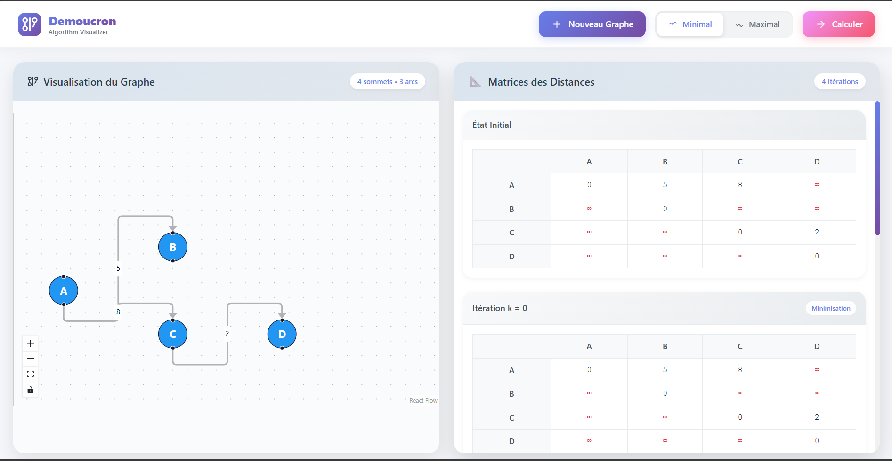

# Projet RO : CHO - Demoucron Min-Max

---

## 📸 Aperçu

<p align="center">
  
</p>

---

## 📘 Description

Ce projet s’inscrit dans le domaine de la **Recherche Opérationnelle (RO)** et met en œuvre l’algorithme :

### 🔹 CHO – Demoucron Min-Max

L’objectif principal est de :
- Modéliser un **graphe orienté**
- Appliquer l’algorithme de **Demoucron Min-Max**
- Visualiser les résultats de manière claire et interactive

---

## ◙ Objectifs pédagogiques

- Comprendre le fonctionnement des graphes
- Implémenter un algorithme d’ordonnancement
- Visualiser les étapes de calcul
- Interpréter les résultats obtenus

---

## ◙ Technologies utilisées

- React
- React Flow (visualisation de graphe)
- JavaScript (logique algorithmique)
- CSS (design et interface)

---

## ◙ Lancement rapide (Windows)

Un script PowerShell est fourni pour **automatiser totalement le lancement du projet**.

### ◙ Étapes

#### Cloner le projet ; Installer les dépendances et Lancer le projet
```bash
git clone <url-du-repository>
cd <nom-du-projet>
npm install
npm run dev